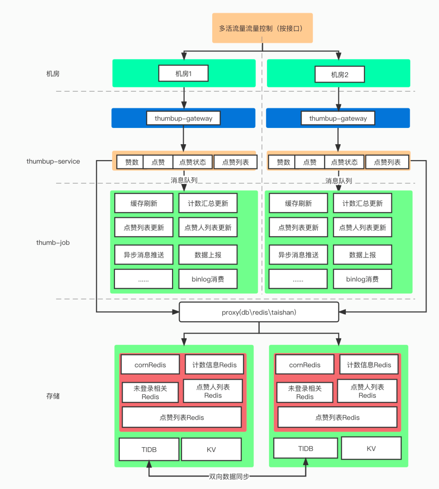

## 业务知识

---

### 1. 审核：先发后审

“先发后审”和“先审后发”的适用场景：“先发后审”：适用于对发布内容及时性要求较高的场景，如阅读、听歌曲等场景的用户评论。此时，用户发表的评论更为即兴创作。因此，从用户的角度来看，他们希望他们的评论能立即看到成功和有效。比如网易云音乐评论。“先审后发”：适用于在社区、论坛、新闻平台等场景下发表文章、意见、讨论等。此时，平台需要对内容负责，并建立权威，因此通常需要在审查后发表。例如：抖音，每个人都是产品经理。1、无论审核方法是什么，都应包括以下四个基本模块：机器审核、人工审核、用户投诉审核和结果审核。1.机器审核是根据制定的规则或机器学习算法来审核内容。

---

### 2. 评论、点赞互动机制

#### 基于redis实现

++，--。

#### 怎么取消点赞？

可能不只需要一个值，还需要用户点赞、取消的状态，需要依赖db

#### 聚合减少io

针对写流量，为了保证数据写入性能，我们在写入【点赞数】数据的时候，在内存中做了部分聚合写入，比如聚合10s内的点赞数，一次性写入。如此可大量减少数据库的IO次数。

#### 单点流量（热点）压力：

热门事件、稿件等带来的系统热点问题，包括DB热点、缓存热点

当一个稿件成为超级热门的时候，大量的流量就会涌入到存储的单个分片上，造成读写热点问题。此时需要有热点识别机制来识别该热点，并将数据缓存至本地，并设置合理的TTL。例如，UP主 【杰威尔音乐】发布第一个稿件的时候就是一次典型热点事件。

---------------------------------

## 技术知识

---

### 1. 基于实例调权的分布式限流

#### 相比于每台机器平分集群总数的模型

由于负载无法完全均衡，往往低于集群总数，不可能超过

通过时间窗口，计算当前实例占用了集群数量的百分比，然后动态调整？

不太具备可行性，但可以作为思路

---------------------------------

## 知识复习

---

### 1. netty双链模型

netty pipeline双向链表。

每个handle节点，又有一个责任链，state？

总体上定义逻辑步骤，然后每个逻辑又有具体实现的链。

蕾丝processor+implementor模型