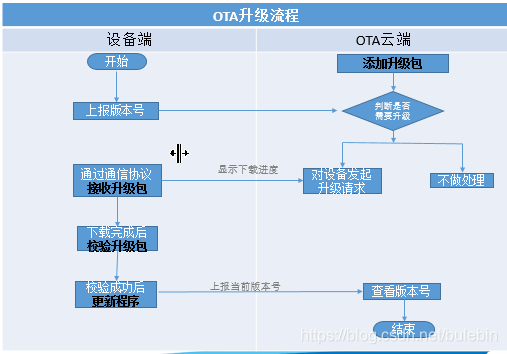

## 业务知识

---

### 1. OTA

OTA：Over-the-Air Technology，即空中下载技术。

---

### 2. 车机芯片能力

奔腾8165芯片、8核CPU，800tops

需要运行各种功能，来测试cpu的性能

当一些传感器没有较大变化时，会通过采样减少数据处理量

--- 

### 3. 车辆打车租车地理定位

如果精确到经纬度，那数据量太大了

会划分为不同区域，每个区域有一个中心点；然后根据经纬度获取当前区域的中心点

再通过距离，算出附近的区域中心点；从而可以直接获取当前几个区域内的资源

---------------------------------

## 技术知识

---

### 1. sql-类型不对导致索引失效

1. 当索引类型为string时
2. 查询name为数字时(全表扫描--发生了隐式类型转换，索引失效)
3. 查询name为字符串时(走索引)

#### 隐式转换

MySQL 的官方文档：dev.mysql.com/doc/refman/…，介绍了 MySQL类型隐式转换的规则：

当算子两边的操作数类型不一致时，MySQL会发生类型转换以使操作数兼容，这些转换是隐式发生的。下面描述了比较操作的隐式转换：

* 如果一个或两个参数均为NULL，则比较结果为NULL；但是 <=> 相等比较运算符除外，对于NULL <=> NULL，结果为true，无需转换。
* 如果比较操作中的两个参数都是字符串，则将它们作为字符串进行比较。
* 如果两个参数都是整数，则将它们作为整数进行比较。
* 如果十六进制不是和数字作比较，它会被视作是二进制字符串。
* 如果参数之一是TIMESTAMP或DATETIME列，而另一个参数是常量，则在执行比较之前，该常量将转换为时间戳，但对于IN() 内的参数不执行此操作。为了安全起见，在进行比较时，请始终使用完整的时间、日期或时间字符串。例如，要在日期和时间参数上使用 BETWEEN 函数时，最好使用 CAST() 函数把参数显示转换成所需的数据类型。
* 一个或多个表中的单行子查询不视为常量。例如，如果子查询返回的整数要与DATETIME值进行比较，则比较将作为两个整数完成，子查询返回的整数不转换为时间值。参见上一条，这种情况下请使用CAST()将子查询的结果整数值转换为DATETIME。
* 如果参数之一是十进制值，则比较取决于另一个参数。如果另一个参数是十进制或整数值，则将参数作为十进制值进行比较；如果另一个参数是浮点值，则将参数作为浮点值进行比较。
* 在所有其他情况下，将参数作为浮点数（实数）进行比较。例如，将字符串和数字操作数进行比较，将其作为浮点数的比较。

---------------------------------

## 知识复习

---

### 1. xx