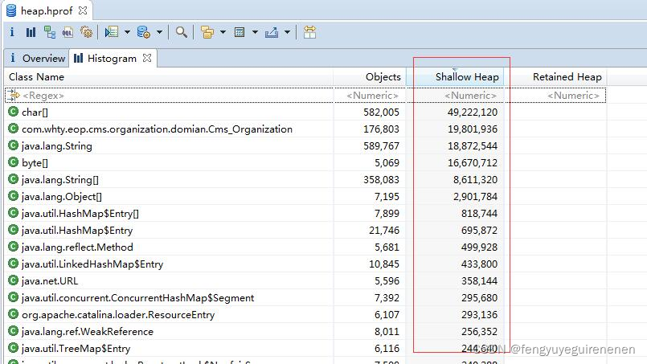
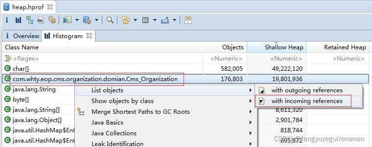
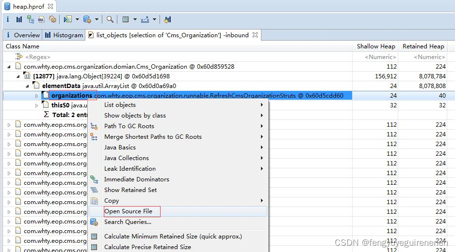

## 业务知识

---

### 1. xx

---

### 2. xx

---------------------------------

## 技术知识

---

### 1. dump分析引用和源码

Shllow Heap排序后发现 Cms_Organization 这个类占用的内存比较多（没有得到及时GC），查看引用：

分析引用栈，找到无效引用，打开源码：

有问题的源码如下：

---------------------------------

## 知识复习

---

### 1. xx
     